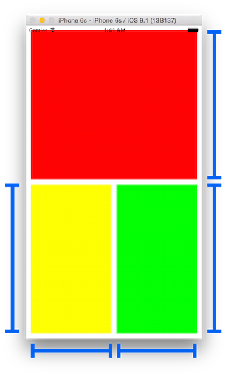

# MisterFusion

[](https://developer.apple.com/iphone/index.action)
[](https://developer.apple.com/swift)
[](http://cocoapods.org/pods/MisterFusion)
[](http://cocoapods.org/pods/MisterFusion)

[ManiacDev.com](https://maniacdev.com/) referred.  
[https://maniacdev.com/2015/12/open-source-auto-layout-library-with-a-simple-and-concise-syntax](https://maniacdev.com/2015/12/open-source-auto-layout-library-with-a-simple-and-concise-syntax)


MisterFusion makes more easier to use AutoLayout in Swift & Objective-C code.

#### MisterFusion Code for Swift

```swift
let view = UIView()
self.view.addLayoutSubview(view, andConstraints:
    view.Top    |+| 10,
    view.Right  |-| 10,
    view.Left   |+| 10,
    view.Bottom |-| 10
)
```

#### Ordinary Code for Swift

This is same implementation as above code, but this is hard to see.

```swift
let view = UIView()
self.view.addSubview(view)
view.translatesAutoresizingMaskIntoConstraints = false
self.view.addConstraints([
    NSLayoutConstraint(item: view, attribute: .Top,    relatedBy: .Equal, toItem: self.view, attribute: .Top,    multiplier: 1, constant:  10),
    NSLayoutConstraint(item: view, attribute: .Right,  relatedBy: .Equal, toItem: self.view, attribute: .Right,  multiplier: 1, constant: -10),
    NSLayoutConstraint(item: view, attribute: .Left,   relatedBy: .Equal, toItem: self.view, attribute: .Left,   multiplier: 1, constant:  10),
    NSLayoutConstraint(item: view, attribute: .Bottom, relatedBy: .Equal, toItem: self.view, attribute: .Bottom, multiplier: 1, constant: -10),
])
```

#### MisterFusion Code for Objective-C

```objective-c
UIView *view = [UIView new];
[self.view addLayoutSubview:view andConstraints:@[
    view.Top   .Constant(10.0f),
    view.Right .Constant(-10.0f),
    view.Left  .Constant(10.0f),
    view.Bottom.Constant(-10.0f)
]];
```

#### Ordinary Code for Objective-C

This is same implementation as above code, but this is hard to see.

```objective-c
UIView *view = [UIView new];
view.translatesAutoresizingMaskIntoConstraints = NO;
[self.view addSubview: view];
[self.view addConstraints:@[
    [NSLayoutConstraint constraintWithItem:view attribute:NSLayoutAttributeTop    relatedBy:NSLayoutRelationEqual toItem:self.view attribute:NSLayoutAttributeTop    multiplier:1.0f constant:10.0f],
    [NSLayoutConstraint constraintWithItem:view attribute:NSLayoutAttributeRight  relatedBy:NSLayoutRelationEqual toItem:self.view attribute:NSLayoutAttributeRight  multiplier:1.0f constant:-10.0f],
    [NSLayoutConstraint constraintWithItem:view attribute:NSLayoutAttributeLeft   relatedBy:NSLayoutRelationEqual toItem:self.view attribute:NSLayoutAttributeLeft   multiplier:1.0f constant:10.0f],
    [NSLayoutConstraint constraintWithItem:view attribute:NSLayoutAttributeHeight relatedBy:NSLayoutRelationEqual toItem:self.view attribute:NSLayoutAttributeHeight multiplier:0.5f constant:-15.0f]
]];
```

#### Sample Layout



If you want to realize layout like a above image, needed code is only this.

```swift
let redView = UIView()
redView.backgroundColor = .redColor()
self.view.addLayoutSubview(redView, andConstraints:
    redView.Top   |+| 10,
    redView.Right |-| 10,
    redView.Left  |+| 10
)

let yellowView = UIView()
yellowView.backgroundColor = .yellowColor()
self.view.addLayoutSubview(yellowView, andConstraints:
    yellowView.Top    |==| redView.Bottom |+| 10,
    yellowView.Left   |+|  10,
    yellowView.Bottom |-|  10,
    yellowView.Height |==| redView.Height
)

let greenView = UIView()
greenView.backgroundColor = .greenColor()
self.view.addLayoutSubview(greenView, andConstraints:
    greenView.Top    |==| redView.Bottom    |+| 10,
    greenView.Left   |==| yellowView.Right  |+| 10,
    greenView.Bottom |-|  10,
    greenView.Right  |-|  10,
    greenView.Width  |==| yellowView.Width,
    greenView.Height |==| yellowView.Height
)
```

## Installation

#### CocoaPods

MisterFusion is available through [CocoaPods](http://cocoapods.org). If you have cocoapods 0.39.0 or greater, you can install
it, simply add the following line to your Podfile:

	pod "MisterFusion"

In addtion, import **MisterFusion** like this.

##### Swift

    import MisterFusion

##### Objective-C

    #import <MisterFusion/MisterFusion-Swift.h>

## Advanced Setting

You can set `multiplier`, `constant` and `priority` like this.
(This is same implementation as [first example](#misterfusion-code-for-swift).)

#### Swift

```swift
self.view.addLayoutSubview(view, andConstraints:
    view.Top    |==| self.view.Top    |*| 1 |+| 10 |<>| UILayoutPriorityRequired,
    view.Right  |==| self.view.Right  |*| 1 |-| 10 |<>| UILayoutPriorityRequired,
    view.Left   |==| self.view.Left   |*| 1 |+| 10 |<>| UILayoutPriorityRequired,
    view.Bottom |==| self.view.Bottom |*| 1 |-| 10 |<>| UILayoutPriorityRequired
)
```

#### Objective-C

```objective-c
[self.view addLayoutSubview:view andConstraints:@[
    view.Top   .Equal(self.view.Top)   .Multiplier(1.0f).Constant(10.0f) .Priority(UILayoutPriorityRequired),
    view.Right .Equal(self.view.Right) .Multiplier(1.0f).Constant(-10.0f).Priority(UILayoutPriorityRequired),
    view.Left  .Equal(self.view.Left)  .Multiplier(1.0f).Constant(10.0f) .Priority(UILayoutPriorityRequired),
    view.Bottom.Equal(self.view.Bottom).Multiplier(1.0f).Constant(-10.0f).Priority(UILayoutPriorityRequired)
]];
```

## For Swift

#### Operators

- `|==|`, `|<=|`, `|>=|` ... `NSLayoutRelation`
- `|*|`, `|/|` ... `multiplier`
- `|+|`, `|-|` ... `constant`
- `|<>|` ... `UILayoutPriority`
- `|=|` ... For fixed `Height` and `Width`

#### UIView Extensions

```swift
public func addLayoutConstraint(misterFusion: MisterFusion) -> NSLayoutConstraint
public func addLayoutConstraints(misterFusions: MisterFusion...) -> [NSLayoutConstraint]
public func addLayoutConstraints(misterFusions: [MisterFusion]) -> [NSLayoutConstraint]
public func addLayoutSubview(subview: UIView, andConstraint misterFusion: MisterFusion) -> NSLayoutConstraint
public func addLayoutSubview(subview: UIView, andConstraints misterFusions: [MisterFusion]) -> [NSLayoutConstraint]
public func addLayoutSubview(subview: UIView, andConstraints misterFusions: MisterFusion...) -> [NSLayoutConstraint]
```

#### Array Extensions

```swift
public func firstItem(view: UIView) -> [NSLayoutConstraint]    
public func firstAttribute(attribute: NSLayoutAttribute) -> [NSLayoutConstraint]   
public func relation(relation: NSLayoutRelation) -> [NSLayoutConstraint]  
public func secondItem(view: UIView) -> [NSLayoutConstraint]    
public func secondAttribute(attribute: NSLayoutAttribute) -> [NSLayoutConstraint]
```

You can get added `NSLayoutConstraint` with those functions.
This is a example.

```swift
let bottomConstraint: NSLayoutConstraint = self.view.addLayoutSubview(view, andConstraints:
    view.Top    |+| 10,
    view.Right  |-| 10,
    view.Left   |+| 10,
    view.Bottom |-| 10
).firstAttribute(.Bottom).first
```

## For Objective-C

### Readonly Blocks

```objective-c
@interface MisterFusion : NSObject
//NSLayoutRelation
@property (nonatomic, readonly, copy) MisterFusion * __nullable (^ __nonnull Equal)(MisterFusion * __nonnull);
@property (nonatomic, readonly, copy) MisterFusion * __nullable (^ __nonnull LessThanOrEqual)(MisterFusion * __nonnull);
@property (nonatomic, readonly, copy) MisterFusion * __nullable (^ __nonnull GreaterThanOrEqual)(MisterFusion * __nonnull);
//multiplier
@property (nonatomic, readonly, copy) MisterFusion * __nullable (^ __nonnull Multiplier)(CGFloat);
//constant
@property (nonatomic, readonly, copy) MisterFusion * __nullable (^ __nonnull Constant)(CGFloat);
@property (nonatomic, readonly, copy) MisterFusion * __nullable (^ __nonnull NotRelatedConstant)(CGFloat);
//UILayoutPriority
@property (nonatomic, readonly, copy) MisterFusion * __nullable (^ __nonnull Priority)(UILayoutPriority);
@end
```

#### UIView Category

```objective-c
- (NSLayoutConstraint * __nonnull)addLayoutConstraint:(MisterFusion * __nonnull)misterFusion;
- (NSArray<NSLayoutConstraint *> * __nonnull)addLayoutConstraints:(NSArray<MisterFusion *> * __nonnull)misterFusions;
- (NSLayoutConstraint * __nonnull)addLayoutSubview:(UIView * __nonnull)subview andConstraint:(MisterFusion * __nonnull)misterFusion;
- (NSArray<NSLayoutConstraint *> * __nonnull)addLayoutSubview:(UIView * __nonnull)subview andConstraints:(NSArray<MisterFusion *> * __nonnull)misterFusions;
```

#### NSArray Category
```objective-c
@property (nonatomic, readonly, copy) NSArray * __nonnull (^ __nonnull FirstItem)(UIView * __nonnull);
@property (nonatomic, readonly, copy) NSArray * __nonnull (^ __nonnull FirstAttribute)(NSLayoutAttribute);
@property (nonatomic, readonly, copy) NSArray * __nonnull (^ __nonnull SecondItem)(UIView * __nonnull);
@property (nonatomic, readonly, copy) NSArray * __nonnull (^ __nonnull SecondAttribute)(NSLayoutAttribute);
@property (nonatomic, readonly, copy) NSArray * __nonnull (^ __nonnull Reration)(NSLayoutRelation);
```

You can get added `NSLayoutConstraint` with those properties.
This is a example.

```objective-c
NSLayoutConstraint *bottomConstraint = [self.view addLayoutSubview:view andConstraints:@[
    view.Top   .Constant(10.0f),
    view.Right .Constant(-10.0f),
    view.Left  .Constant(10.0f),
    view.Bottom.Constant(-10.0f)
]].FirstAttribute(NSLayoutAttributeBottom).firstObject;
```

## Requirements

- Xcode 7.0 or greater
- iOS8.0 or greater

## Author

Taiki Suzuki, s1180183@gmail.com

## License

MisterFusion is available under the MIT license. See the LICENSE file for more info.
